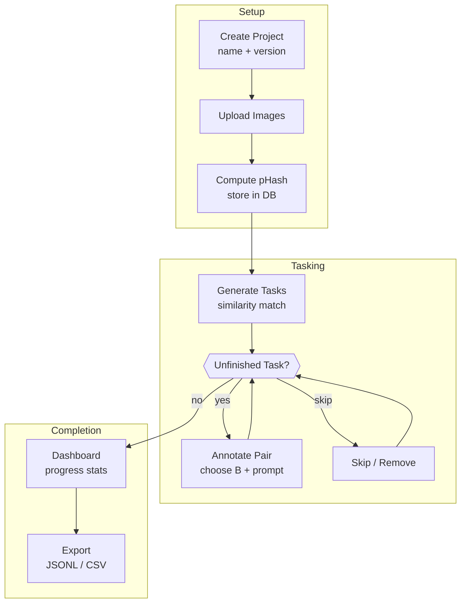

# Image Edit Dataset Annotator – Phased POC Plan

A lightweight, single‑developer tool that lets you import a folder of images, rapidly pair them (A → B), write an edit prompt, track progress, and export the result in a machine‑readable format.  Everything runs **locally** with no external services.

---

## 1 · Baseline Assumptions

| # | Assumption                                                  | Notes                                                 |
| - | ----------------------------------------------------------- | ----------------------------------------------------- |
| 1 | Personal, single‑user workflow                              | No authentication, no concurrent users.               |
| 2 | Images live on disk inside each *project* directory         | We store relative file paths only.                    |
| 3 | Export → **JSONL** (default) and **CSV**                    | One row per completed task.                           |
| 4 | Similarity = perceptual hash (**pHash**) + Hamming distance | Good‑enough recall for suggesting candidate B images. |
| 5 | State management = **React Context + URL params**           | No external store like Zustand/Redux.                 |
| 6 | No Docker                                                   | `python -m venv` and `npm install` are enough.        |

---

## 2 · Tech Stack (optimised for speed & simplicity)

| Layer         | Choice                                         | Rationale                                                               |
| ------------- | ---------------------------------------------- | ----------------------------------------------------------------------- |
| UI            | **React + Vite + TypeScript + Tailwind**       | Instant dev server, utility CSS, strong TS DX.                          |
| State         | React Context + `useReducer` + URLSearchParams | URL encodes the wizard step & IDs, context holds transient bits.        |
| Backend       | **Golang**                      | Minimal boilerplate, async, first‑class type hints, Uvicorn dev server. |
| DB            | **SQLite**                        | File‑backed, shipped in stdlib; zero infra.                             |
| Image hashing | **goimagehash**                         | One‑liner `imagehash.phash(Image.open(path))`.                          |

---

## 3 · Phase Roadmap

> **Estimates** assume 1 engineer; each phase ≈ 0.5–1 day.

| Phase  | Goal                | Key Steps                                                                                                                                                       |
| ------ | ------------------- | --------------------------------------------------------------------------------------------------------------------------------------------------------------- |
| **P1** | *Project skeleton*  | ① `pnpm create vite` → starter React app with Typescript. API stub with `/ping`. ③ CORS + Axios handshake.                                                                |
| **P2** | *Data model*        | ① Define entities `Project`, `Image`, `Task`. ② CRUD endpoints. ③ React form to create / open project.                                                 |
| **P3** | *Ingest & Hash*     | ① Drag‑and‑drop `<input type="file" multiple>` → POST `/upload`. ② Backend saves into `projects/<id>/images/`. ③ Async pHash compute;         |
| **P4** | *Task generator*    | ① For each image, fetch N most‑similar (self‑join on Hamming ≤ h). ② Insert `Task` rows with candidate B list. If there were no similar images then still add the task but we'll allow the user to select from the image pool in the UI.                                                  |
| **P5** | *Annotation UI*     | ① Wizard page shows A image + candidate B thumbnails. ② Keyboard shortcuts `1‑9` to pick, `s` skip, `d` delete. ③ Prompt textarea autofocused; PUT `/task/:id`. |
| **P6** | *Progress & Resume* | ① Dashboard counts (total / done / skipped). ② Resume button jumps to first unfinished. ③ Option to re‑queue skipped.                                           |
| **P7** | *Export*            | ① `/export/jsonl` streams file. ② `/export/csv` alternative schema. ③ Download triggers in browser.                                                             |
| **P8** | *Polish*            | ① Make the UI look pretty, clean, elegant etc. Like the sort of product Apple would release.                                                                                   |

---

## 4 · User Flow (Mermaid)



---

## 5 · Export Schema Examples

### 5.1  JSONL (default)

```json
{"a": "images/0001.jpg", "b": "images/0001_edit.jpg", "prompt": "turn sky pink"}
```

### 5.2  CSV

```csv
a,b,prompt
images/0001.jpg,images/0001_edit.jpg,"turn sky pink"
```

## Style

- Keep it simple
- YAGNI
- Prefer storing application state in the URL where possible.
- Build on standards (e.g Web APIs like `new URL`, `intl` are a good start).
- Make impossible states unrepresentable, e.g use discriminated union state object rather than multiple states for managing request lifecycle.

- Run build commands on fontend/backend to ensure no errors.
- This project is in an experimental/WIP stage, don't worry about keeping things backwards compatible. Deleting existing code is perfectly fine. You can delete existing database data and modify the migrations and reset the db.
